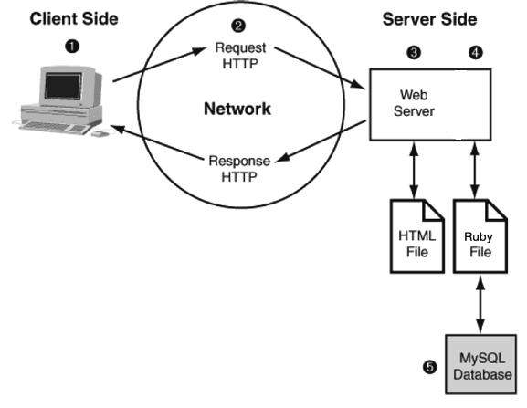

User Stories 
----

```sh
As a makers student
So that I can access my favourite websites more quickly
I would like to be able to see a list of links from the database

As a makers student
So that I can add my future favourite websites
I would like to be able to add new links

As a makers student
So that I can organise my favourite websites
I would like to be able to tag my links

As a makers student
So that I can quickly look through my bookmark
I would like to be able to filter my links by tag
```

Client-Server Relationship Diagram
----

